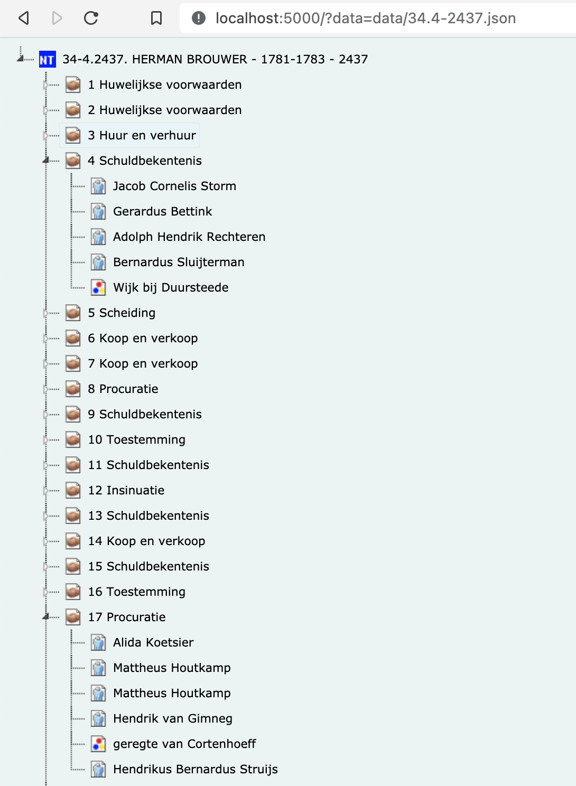

# MFXML preview
Een script om een MFXML bestand om te zetten naar JSON.
Vervolgens kan het JSON bestand als boomstructuur worden bekeken in de browser.

## Voorbeeld
```bash
./mfxmlpreview.py data/34.4-2437.xml data/34.4-2437.json
```

Start vervolgens een webserver bijv met `serve` en bekijk de boomstructuur in je browser via http://localhost:5000?data=data/34.4-2437.json


